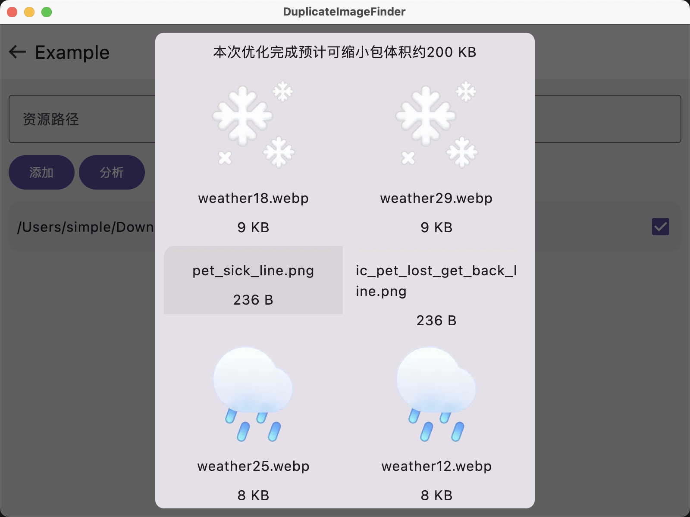
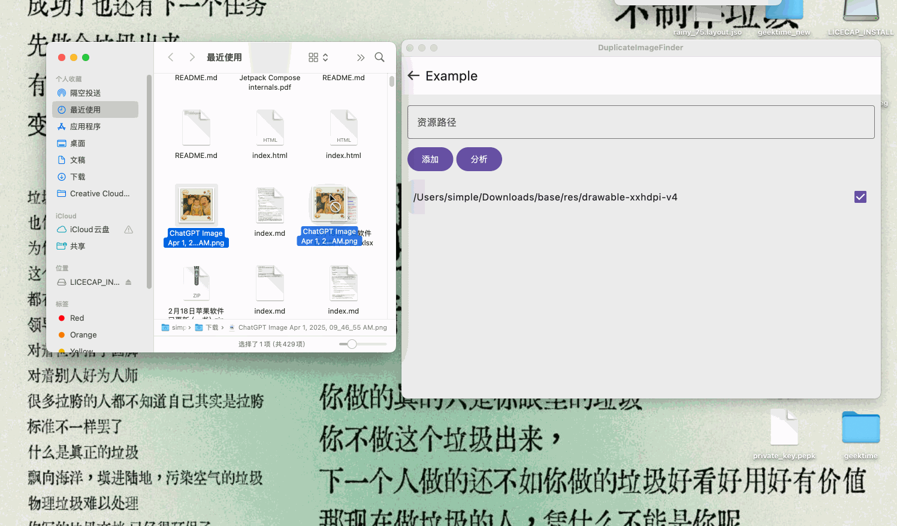

# DuplicateImageFinder

检测项目里有多少重复图片资源。

拖拽资源文件到指定目录，如何已存在会弹框提示。

## 依赖

[compose-multiplatform](https://github.com/JetBrains/compose-multiplatform)
[cmp-navigation](https://www.jetbrains.com/help/kotlin-multiplatform-dev/compose-navigation.html)
[coil](https://github.com/coil-kt/coil)
[sqldelight](https://github.com/sqldelight/sqldelight)
[kottie](https://github.com/ismai117/kottie)
